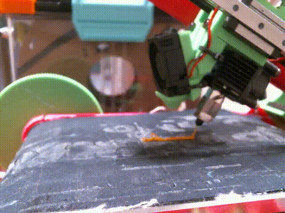

# BeltPrinter

A collection of firmware, macros, IdeaMaker configurations, and printable mods for belt-style 3D printers (such as the BabyBeltPro).  
This repository includes slicer tools, calibration methods, quality-of-life macros, and custom STL upgrades.

<!-- ffmpeg -i timelapse.mp4 -vf "fps=15,scale=480 :-1:flags=lanczos" -lossless 1 -loop 0 timelapse.gif -->

## 📁 Navigation

### 🧰 Firmware
- [SKR Mini E3 V3 – DFU / Katapult Bootloader Guide](./firmware/README.md)

### ⚙️ Klipper Macros
Macros designed to improve belt-printer workflow, reliability, and print quality.

- [`belt_print_start`](./macro/belt_print_start.cfg) – Belt-optimized start sequence  
- [`belt_print_end`](./macro/belt_print_end.cfg) – Managed end-of-print procedure  
- [`belt_print_cancel`](./macro/belt_print_cancel.cfg) – Safe print cancellation  
- [`belt_safe_park`](./macro/belt_safe_park.cfg) – Safely park the toolhead  
- [`belt_set_offset`](./macro/belt_set_offset.cfg) – Determine and set Y-offset  
- [`belt_validate_angle`](./macro/belt_validate_angle.cfg) – Verify printer angle matches slicer value  

### 🖨️ IdeaMaker Tools & Calibration Guides

- [Repetition & Repetition Calibration](./ideaMaker/Repetition/README.md)  
- [Customize G-Code Filename](./ideaMaker/Customize%20GCode%20Filename/README.md)  
- [Gap Fill Visualization](./ideaMaker/Gap%20Fill/)  
- [First Layer Speed Guide](./ideaMaker/First%20Layer%20Speed/)  

### 🗂 Templates
Located in: [`ideaMaker/Templates`](./ideaMaker/Templates)

### 🧱 BabyBelt Mods & Calibration Objects

- [Printable Mods & Calibration STLs](./STL/)

## 📝 Guiding Assumptions

### Mechanical
- **Keep the belt tight** – Reduces belt slip and minimizes part movement during printing.
- **Ensure the belt is level with the rollers** – Keeps parts aligned as they leave the heated build surface and begin cooling before reaching the scraper.
- **Minimize nozzle drag** – Helps avoid surface artifacts and improves part release.

### Reducing Drag, Consequential Effects
- **Use slightly higher print temperatures** – Lowers plastic resistance under the nozzle, reducing drag.
- **Reduce print speeds** – Slower movement reduces the tensile pull on the molten filament as it exits the nozzle.
- **Expect a lower extrusion multiplier (EM)** – Reducing flow helps avoid excess material that increases nozzle drag.
