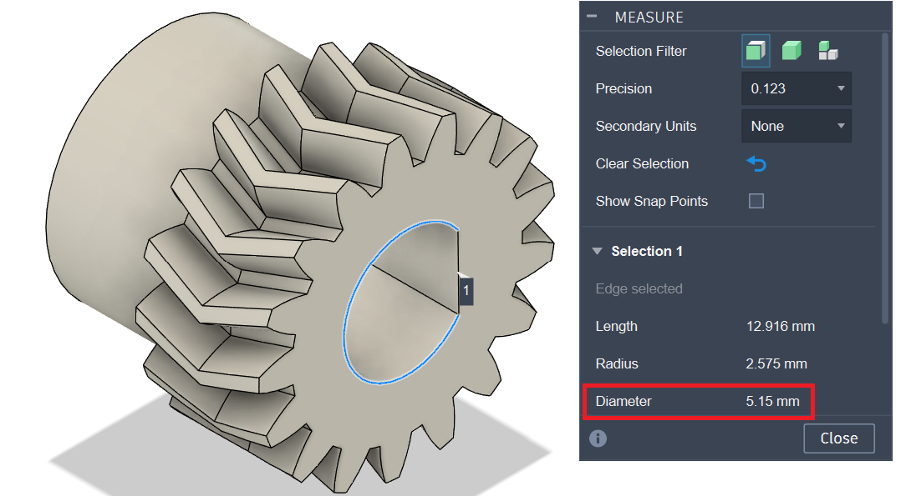

# BabyBeltPro - Tighter Nema 17 Gear

The Nema 17 motor shaft is 5 mm. I reduced the inner diameter of the gear to **5.15 mm** to achieve a tighter and more secure grip on the shaft.

A chamfered variant is available to help guide the gear onto the shaft, as well as a non-chamfered version for a tighter overall fit.
---

## Example

