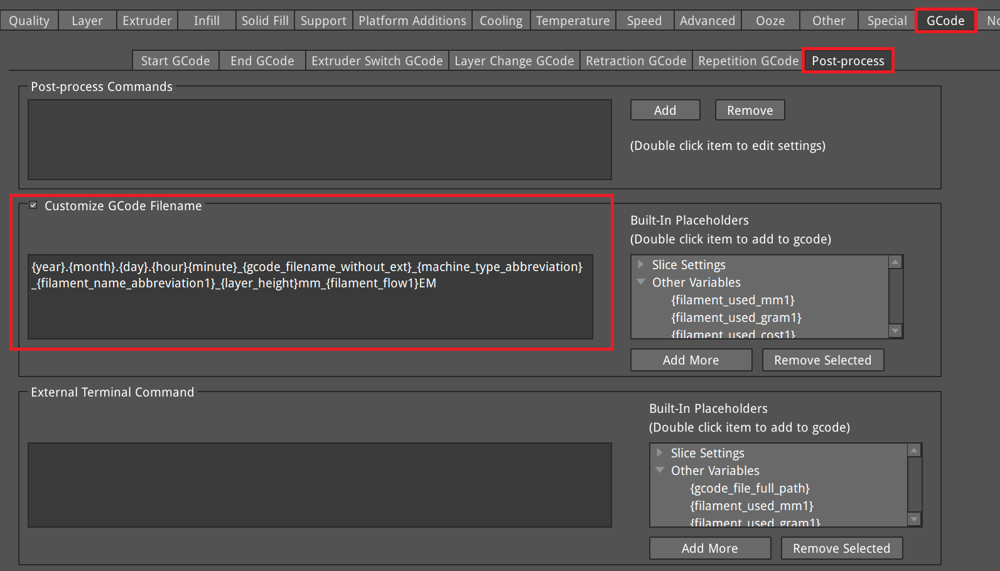

# Customize GCode Filename

Place the following string in IdeaMaker under:

**GCode → Post-Process → Customize GCode Filename**

## Example


## Filename Format String

```
{year}.{month}.{day}.{hour}{minute}_{gcode_filename_without_ext}_{machine_type_abbreviation}_{filament_name_abbreviation1}_{layer_height}mm_{filament_flow1}EM
```


