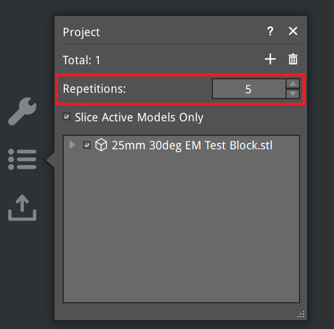

# Repetition in IdeaMaker for Belt Printers

IdeaMaker includes a **Repetition** feature designed for belt printers that allows execution of macros between printed objects.

However, the default behavior has several limitations:

- The extruder is retracted back to **E=0** between objects  
- The belt (Z-axis) is returned to **Z=0** between objects  
- Objects are printed **with no spacing** between them (see above)

**Good news:**  
By inserting custom G-code between repetitions, we can override these behaviors and gain full control.

---

## What Custom Repetition G-Code Allows

Using these G-code macros lets you:

- Reset **E** and **Z** to 0 between objects—avoiding the default resets  
- Add adjustable spacing between objects  
- Track and count printed objects  
- Home an axis (e.g., **Y**) between objects to prevent drift or lost steps  
- Modify runtime parameters such as **extrusion multiplier / flow** for calibration prints  

---

## Configuration

### 1. Enable Repetition in `printer.cfg`

Add the following configuration file to your setup:

[belt_repetition.cfg](../../macro/belt_repetition.cfg)

---

### 2. Set the Repetition Count

Increase the **Repetitions** value to match the number of objects you want to print.



---

### 3A. Standard Repetition G-Code

Insert this macro into IdeaMaker’s **G-Code Between Repetitions** section:

```
_REPETITION
```

---

### 3B. Repetition for EM / Flow Calibration

Use this version for extrusion multiplier (EM) / flow calibration:

```
_EM_CALIBRATE_REPETITION [EM_STEPS=0.0X]
```

Where `EM_STEPS` defines the **negative** incremental change applied for each repeated object (Default: 0.02mm).

---

## Examples

Standard repetition example:  
[Example](./Example_Obj.png)

Calibration repetition example:  
[Example Calibrate](./Example_Calibrate.png)
